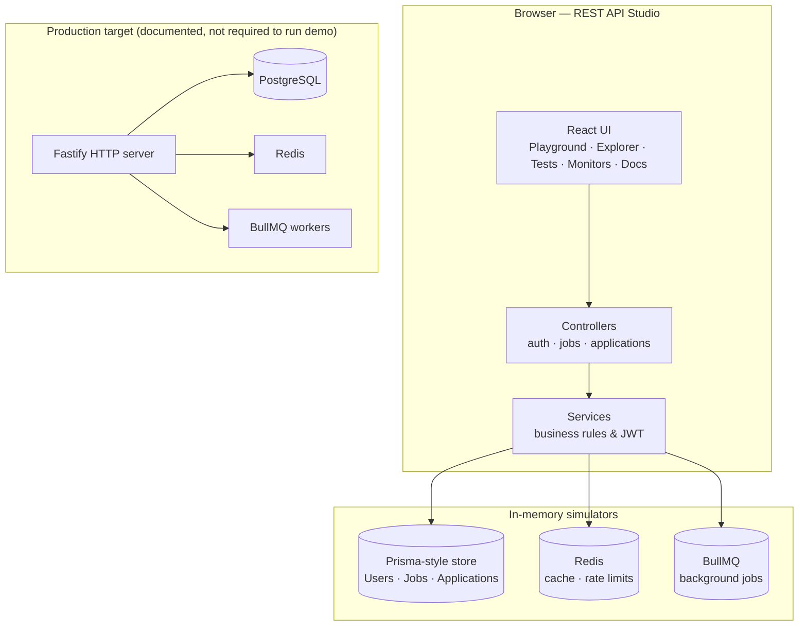

# REST API Studio & Docs

An interactive portfolio application that demonstrates how an **enterprise Job Board REST API** is designed and operated—auth flows, job listings, applications, caching, queues, and tests—inside a single React workspace.

> **What this repo is:** A browser-based **API studio** (Swagger-style playground, code explorer, live infra monitors, architecture docs). The business logic in `src/modules/` runs against **in-memory** PostgreSQL, Redis, and BullMQ simulators so you can explore the system without Docker or a live backend.
>
> **What it showcases:** Production patterns you would ship with **Fastify**, **Prisma**, **PostgreSQL**, **Redis**, and **BullMQ**—documented in code, schema, and the built-in blueprint tab.

---

## Table of contents

- [Features](#features)
- [Tech stack](#tech-stack)
- [Architecture](#architecture)
- [API endpoints](#api-endpoints)
- [Data model](#data-model)
- [Project structure](#project-structure)
- [Getting started](#getting-started)
- [Try it: demo walkthrough](#try-it-demo-walkthrough)
- [Build & deploy](#build--deploy)
- [Tests](#tests)
- [Environment variables](#environment-variables)
- [Roadmap](#roadmap)
- [License](#license)

---

## Features

| Area | Description |
|------|-------------|
| **Swagger Client** | Execute REST endpoints with JSON bodies, view HTTP status and timing, and bind JWT sessions from login/register/refresh. |
| **Code Directory** | Browse highlighted source for Prisma schema, core infra, modules, tests, and reference Fastify route definitions. |
| **Jest Spec Suite** | Animated test-runner console that mirrors a full CI run (auth, jobs, rate limiter) with coverage summary. |
| **Core Monitors** | Live views of in-memory **Users / Jobs / Applications**, Redis keys & rate-limit logs, and BullMQ job ledger + worker events. |
| **System Blueprint** | In-app documentation for RS256 JWT rotation, sliding-window rate limits, async workers, and deployment notes. |

### Security & backend patterns (implemented in the service layer)

- **JWT access tokens** (15-minute TTL) and **refresh token rotation** (7-day sliding sessions)
- **Refresh token reuse detection** — replays revoke all active sessions for the user
- **Role-based access** — `USER`, `COMPANY_REP`, `ADMIN`
- **Password hashing** via Node `crypto` (HMAC-SHA256 in the demo; bcrypt/argon2 in production)
- **Zod-validated** request shapes (`auth.schema.ts`)
- **Structured errors** — `ValidationError`, `UnauthorizedError`, `ConflictError`, etc. (`AppError.ts`)
- **Redis sliding-window rate limiting** (simulated; 100 req / 15 min anonymous in the UI)
- **BullMQ-style async jobs** — welcome email, password reset, application notifications, PDF reports

---

## Tech stack

| Layer | Technologies |
|-------|----------------|
| **UI** | React 19, TypeScript, Tailwind CSS 4, Lucide icons, Vite 6 |
| **API design (reference)** | Fastify route schemas, OpenAPI-style tags & responses |
| **Data** | Prisma schema (PostgreSQL target) + in-memory store for the studio |
| **Cache / queue** | Redis & BullMQ simulators (`src/core/cache`, `src/core/queue`) |
| **Validation** | Zod 4 |

---

## Architecture



**Request flow in the playground:** the UI builds a mock Fastify `request` / `reply`, calls the same controllers and services used in a real server, then refreshes monitor panels from the in-memory stores.

---

## API endpoints

Base path: `/api` (simulated in the studio; paths match a future Fastify deployment).

### Authentication

| Method | Path | Auth | Description |
|--------|------|------|-------------|
| `POST` | `/api/auth/register` | Public | Register user; queue welcome email job |
| `POST` | `/api/auth/login` | Public | Issue access + refresh token pair |
| `POST` | `/api/auth/refresh` | Public | Rotate refresh token; detect reuse abuse |
| `POST` | `/api/auth/forgot-password` | Public | Enqueue reset token (Redis TTL + BullMQ) |
| `POST` | `/api/auth/reset-password` | Public | Complete password reset |
| `POST` | `/api/auth/logout` | Bearer | Revoke refresh token |
| `POST` | `/api/auth/promote` | Admin | Elevate user role |

### Jobs & applications

| Method | Path | Auth | Description |
|--------|------|------|-------------|
| `GET` | `/api/jobs` | Public | Search/filter listings (cursor, location, salary, type) |
| `POST` | `/api/jobs` | Company rep / Admin | Create job for own company |
| `GET` | `/api/applications` | Bearer | List applications (scoped by role) |
| `POST` | `/api/applications` | User | Submit application; queue notifications |

---

## Data model

Defined in [`prisma/schema.prisma`](prisma/schema.prisma):

- **User** — email, password hash, role, optional company link
- **Profile** — title, resume URL, bio, skills
- **Company** — verified employers with slug and jobs
- **Job** — listings with `JobType`, salary range, featured flag
- **Application** — status workflow (`APPLIED` → `OFFER` / `REJECTED` / …)
- **RefreshToken** — rotation and revocation tracking

Enums: `Role`, `JobType`, `ApplicationStatus`.

---

## Project structure

```text
rest-api-studio-docs/
├── prisma/
│   └── schema.prisma          # PostgreSQL data model
├── src/
│   ├── App.tsx                # Studio shell (tabs, playground, monitors)
│   ├── core/
│   │   ├── cache/redis.ts     # In-memory Redis + rate-limit logs
│   │   ├── database/prisma.ts # In-memory DB + seed data
│   │   ├── queue/bullmq.ts    # Job queue simulator
│   │   └── errors/AppError.ts
│   ├── modules/
│   │   ├── auth/              # Controller, service, routes, Zod schemas
│   │   ├── jobs/
│   │   └── applications/
│   └── data/mockCode.ts       # Extra files shown in Code Directory
├── tests/
│   ├── auth.service.test.ts
│   ├── jobs.service.test.ts
│   └── rate_limiter.test.ts
├── index.html
├── vite.config.ts
└── package.json
```

---

## Getting started

### Prerequisites

- **Node.js** 18+ (20 LTS recommended)
- **npm** 9+

### Install and run locally

```bash
git clone https://github.com/Vera93203/rest-api-studio-docs.git
cd rest-api-studio-docs

npm install
npm run dev
```

Open **http://localhost:3000**.

### Other scripts

| Command | Description |
|---------|-------------|
| `npm run dev` | Start Vite dev server (port **3000**) |
| `npm run build` | Production build → `dist/` |
| `npm run preview` | Serve the production build locally |
| `npm run lint` | TypeScript check (`tsc --noEmit`) |

No database or Redis installation is required for the interactive studio.

---

## Try it: demo walkthrough

1. Open **Swagger Client** → **Register User** → **Execute Request**.  
   Check **Core Monitors** for a new user row and a `send_welcome_email` queue job.

2. Run **Login Credentials** — the sidebar **TOKEN AUTHORITY** panel shows decoded JWT claims (role, subject).

3. **Query Job Listings** (public), then **Create Job Listing** (requires `COMPANY_REP` or `ADMIN` — register/login as a rep or use **Promote User Role** as admin).

4. **Submit Application** as a `USER`, then **Audit Applications** with the same session.

5. Explore **Code Directory** for route definitions and service implementations.

6. Open **Jest Spec Suite** → **Run Selected Specs** for the simulated CI output.

---

## Build & deploy

The app is a static SPA after `npm run build`.

### GitHub Pages

1. In `vite.config.ts`, set `base: '/your-repo-name/'` if not deploying from the repo root.
2. Build: `npm run build`
3. Deploy the `dist/` folder (e.g. GitHub Actions `peaceiris/actions-gh-pages` or Pages from `gh-pages` branch).

### Vercel / Netlify / Cloudflare Pages

- **Build command:** `npm run build`  
- **Output directory:** `dist`  
- **Install command:** `npm install`

`GEMINI_API_KEY` is optional for this project; the studio does not require it for core API simulation.

---

## Tests

The repository includes Jest-style specs under `tests/` that exercise `authService`, `jobService`, and rate limiting against the **in-memory** stores:

- `tests/auth.service.test.ts` — registration, login, refresh rotation, token reuse, password reset
- `tests/jobs.service.test.ts` — search, pagination, featured ordering, company rep rules
- `tests/rate_limiter.test.ts` — sliding window allow/block/release

The in-app **Jest Spec Suite** tab runs a **visual simulation** of these suites for the portfolio demo. To run the real test files locally, add Jest (or Vitest) to `package.json`—the test source is written and ready to wire up.

---

## Environment variables

Copy [`.env.example`](.env.example) when extending the project (e.g. AI Studio or hosted deployment):

| Variable | Required | Description |
|----------|----------|-------------|
| `GEMINI_API_KEY` | No | Only if you add Gemini-powered features |
| `APP_URL` | No | Public URL for OAuth/callbacks in hosted setups |

For local studio use, **no `.env` file is required**.

---

## Roadmap

Ideas for evolving this from a studio into a full production stack:

- [ ] Fastify HTTP server mounting `authRoutes` and job/application routes
- [ ] Real PostgreSQL via Prisma migrate + `DATABASE_URL`
- [ ] Redis + BullMQ workers in Docker Compose
- [ ] OpenAPI/Swagger UI served from the same origin as the API
- [ ] Vitest/Jest in CI with Testcontainers
- [ ] RS256 keys from PEM files (replace demo HMAC JWT signing)

---

## License

Source files are marked **SPDX-License-Identifier: Apache-2.0**. See file headers for details.

---

## Author

Built as a portfolio piece demonstrating REST API design, auth, and operational concerns for a Job Board platform.

If this project helped you, consider starring the repo on GitHub.
