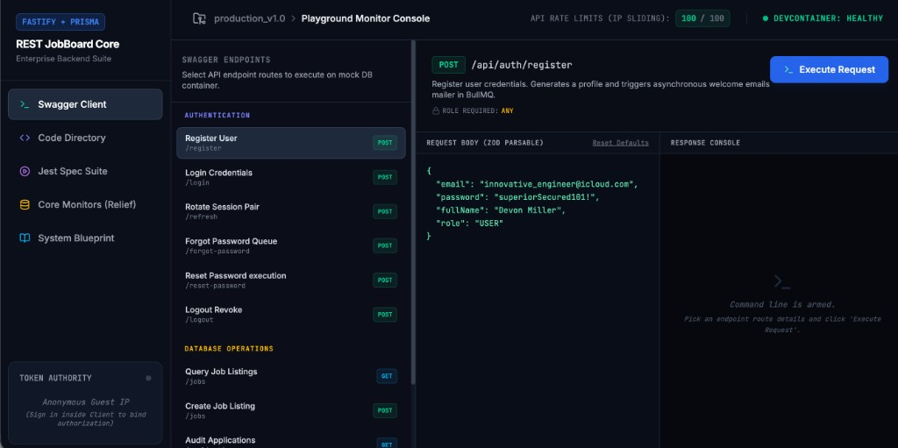
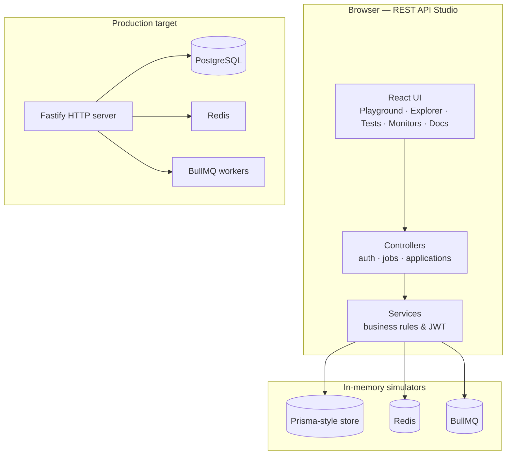

<div align="center">

# REST API Studio & Docs

**Interactive portfolio studio for an enterprise Job Board REST API**

[](https://rest-api-studio-docs-507307610839.europe-west2.run.app)
[](https://github.com/Vera93203/rest-api-studio-docs)
[](https://react.dev/)
[](https://www.typescriptlang.org/)
[](https://vitejs.dev/)
[](https://www.prisma.io/)

[🚀 **Try the live app**](https://rest-api-studio-docs-507307610839.europe-west2.run.app) · [📂 Repository](https://github.com/Vera93203/rest-api-studio-docs) · [⬇ Clone & run locally](#getting-started)

</div>

---

## Live showcase

Explore the full studio in your browser — no install, no database setup.

**→ [https://rest-api-studio-docs-507307610839.europe-west2.run.app](https://rest-api-studio-docs-507307610839.europe-west2.run.app)**

<a href="https://rest-api-studio-docs-507307610839.europe-west2.run.app">
  
</a>

<p align="center"><em>Swagger Client — register users, execute endpoints, and inspect responses in real time</em></p>

### What you can try on the live demo

| Module | What it does |
|--------|----------------|
| **Swagger Client** | Pick routes (`/register`, `/login`, `/jobs`, …), edit JSON bodies, hit **Execute Request**, see HTTP status & timing |
| **Code Directory** | Browse highlighted Prisma schema, services, Fastify routes, and test files |
| **Jest Spec Suite** | Run a simulated CI pipeline with coverage output |
| **Core Monitors** | Watch Users, Jobs, Applications, Redis cache keys, and BullMQ jobs update live |
| **System Blueprint** | Read architecture notes on JWT rotation, rate limits, and async workers |
| **Token Authority** | Sidebar panel shows decoded JWT claims after login |

---

## About this project

**REST API Studio & Docs** is a portfolio application that demonstrates how a production **Job Board REST API** is designed and operated — authentication, listings, applications, caching, queues, and tests — inside one polished React workspace.

> **Studio (this repo):** Business logic in `src/modules/` runs in the browser against **in-memory** PostgreSQL, Redis, and BullMQ simulators. You get real request/response behavior without Docker.
>
> **Production target:** The same patterns map to **Fastify**, **Prisma**, **PostgreSQL**, **Redis**, and **BullMQ** — documented in code, schema, and the in-app blueprint.

---

## Highlights

- **All-in-one backend console** — API playground, codebase viewer, test runner UI, infra monitors, and docs in a single app
- **Fastify + Prisma** — route schemas, controllers, services, and a full relational model (`User`, `Company`, `Job`, `Application`, `RefreshToken`)
- **JWT auth** — access + refresh rotation, reuse detection, role-based access (`USER` · `COMPANY_REP` · `ADMIN`)
- **Zod validation** — request bodies parsed before handlers run
- **Redis rate limiting** — sliding-window limits (100 req / 15 min for anonymous traffic in the UI)
- **BullMQ-style jobs** — welcome emails, password reset, application notifications, PDF reports
- **Deployed on Google Cloud Run** — static SPA, instant access for recruiters and reviewers

---

## Table of contents

- [Live showcase](#live-showcase)
- [About this project](#about-this-project)
- [Features](#features)
- [Tech stack](#tech-stack)
- [Architecture](#architecture)
- [API endpoints](#api-endpoints)
- [Data model](#data-model)
- [Project structure](#project-structure)
- [Getting started](#getting-started)
- [Demo walkthrough](#demo-walkthrough)
- [Build & deploy](#build--deploy)
- [Tests](#tests)
- [Environment variables](#environment-variables)
- [Roadmap](#roadmap)
- [License](#license)

---

## Features

| Area | Description |
|------|-------------|
| **Swagger Client** | Execute REST endpoints with JSON bodies, view HTTP status and timing, bind JWT sessions from login/register/refresh |
| **Code Directory** | Syntax-highlighted source for Prisma schema, core infra, modules, tests, and Fastify route definitions |
| **Jest Spec Suite** | Animated test-runner console mirroring CI (auth, jobs, rate limiter) with coverage summary |
| **Core Monitors** | Live **Users / Jobs / Applications**, Redis keys & rate-limit logs, BullMQ job ledger + worker events |
| **System Blueprint** | In-app docs for RS256 JWT rotation, sliding-window rate limits, async workers, deployment |

### Security & backend patterns

- JWT access tokens (15 min) + refresh rotation (7-day sliding sessions)
- Refresh token reuse detection — replays revoke all active sessions
- Role-based access control
- Structured errors (`ValidationError`, `UnauthorizedError`, `ConflictError`, …)
- Password hashing via Node `crypto` (demo); bcrypt/argon2 in production

---

## Tech stack

| Layer | Technologies |
|-------|----------------|
| **UI** | React 19, TypeScript, Tailwind CSS 4, Lucide, Vite 6 |
| **API design** | Fastify route schemas, OpenAPI-style tags & responses |
| **Data** | Prisma schema (PostgreSQL) + in-memory store for the studio |
| **Cache / queue** | Redis & BullMQ simulators |
| **Validation** | Zod 4 |
| **Hosting** | Google Cloud Run (live demo) |

---

## Architecture



---

## API endpoints

Base path: `/api` (simulated in the studio).

### Authentication

| Method | Path | Auth | Description |
|--------|------|------|-------------|
| `POST` | `/api/auth/register` | Public | Register user; queue welcome email |
| `POST` | `/api/auth/login` | Public | Issue access + refresh tokens |
| `POST` | `/api/auth/refresh` | Public | Rotate refresh token; detect reuse |
| `POST` | `/api/auth/forgot-password` | Public | Enqueue reset token |
| `POST` | `/api/auth/reset-password` | Public | Complete password reset |
| `POST` | `/api/auth/logout` | Bearer | Revoke refresh token |
| `POST` | `/api/auth/promote` | Admin | Elevate user role |

### Jobs & applications

| Method | Path | Auth | Description |
|--------|------|------|-------------|
| `GET` | `/api/jobs` | Public | Search/filter listings |
| `POST` | `/api/jobs` | Company rep / Admin | Create job listing |
| `GET` | `/api/applications` | Bearer | List applications (role-scoped) |
| `POST` | `/api/applications` | User | Submit application |

---

## Data model

See [`prisma/schema.prisma`](prisma/schema.prisma): **User**, **Profile**, **Company**, **Job**, **Application**, **RefreshToken** with enums `Role`, `JobType`, `ApplicationStatus`.

---

## Project structure

```text
rest-api-studio-docs/
├── docs/
│   └── showcase-playground.png   # README screenshot
├── prisma/schema.prisma
├── src/
│   ├── App.tsx                   # Studio shell
│   ├── core/                     # DB, Redis, BullMQ, errors
│   ├── modules/                  # auth, jobs, applications
│   └── data/mockCode.ts
├── tests/
└── package.json
```

---

## Getting started

### Prerequisites

Node.js 18+ · npm 9+

### Local development

```bash
git clone https://github.com/Vera93203/rest-api-studio-docs.git
cd rest-api-studio-docs
npm install
npm run dev
```

Open **http://localhost:3000** — or use the [live demo](https://rest-api-studio-docs-507307610839.europe-west2.run.app) instead.

| Command | Description |
|---------|-------------|
| `npm run dev` | Dev server (port 3000) |
| `npm run build` | Production build → `dist/` |
| `npm run preview` | Preview production build |
| `npm run lint` | TypeScript check |

---

## Demo walkthrough

Try this on the **[live app](https://rest-api-studio-docs-507307610839.europe-west2.run.app)** or locally:

1. **Swagger Client** → **Register User** → **Execute Request** → check **Core Monitors** for a new user and `send_welcome_email` job.
2. **Login** → **Token Authority** shows JWT role and subject.
3. **Query Job Listings**, then **Create Job Listing** (needs `COMPANY_REP` or **Promote User Role**).
4. **Submit Application** → **Audit Applications**.
5. **Code Directory** → explore services and routes.
6. **Jest Spec Suite** → **Run Selected Specs**.

---

## Build & deploy

```bash
npm run build   # output: dist/
```

The live demo is hosted on **Google Cloud Run**. Any static host (Vercel, Netlify, GitHub Pages) works with `dist/` as the publish directory.

---

## Tests

Jest-style specs in `tests/` target in-memory stores. The in-app **Jest Spec Suite** tab simulates CI output for the portfolio demo.

---

## Environment variables

Optional — see [`.env.example`](.env.example). The studio runs without `.env` for local or live use.

---

## Roadmap

- [ ] Fastify HTTP server with real routes
- [ ] PostgreSQL via Prisma migrate
- [ ] Redis + BullMQ workers (Docker Compose)
- [ ] OpenAPI/Swagger from the API origin
- [ ] Vitest/Jest in CI with Testcontainers

---

## License

**Apache-2.0** — see SPDX headers in source files.

---

<div align="center">

**Built as a portfolio piece — enterprise REST API design for a Job Board platform**

[⭐ Star on GitHub](https://github.com/Vera93203/rest-api-studio-docs) · [🚀 Live demo](https://rest-api-studio-docs-507307610839.europe-west2.run.app)

</div>
